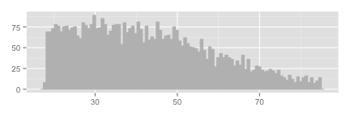
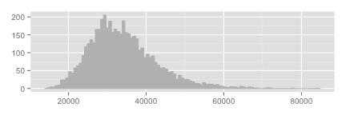
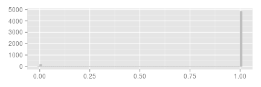

Data Analysis Report
========================================================

Todo : add table of content

Introduction
------------------------
This data analysis report is generated using R-studio and knitr to knit R code and markdown into html format. We have the option to include all R code that is used to generate the plots and calculations. Default this feauture is dissabled.
The data analysis step is the first step an a datamining analysis.

Dataset Basic Artifacts 
------------------------------------
Basic information from the dataset we are using.

### Basic dataset information


```r
i = 1

# data location full path to filename from working directory(=project dir)
path2file <- "../data/data-simple-example.tab"

# read dataframe from tab delimets file
data <- read.delim(path2file, sep = "\t", strip.white = TRUE)

# determine number of rows and colums in dataframe
rows <- nrow(data)
colums <- ncol(data)

# case_id = registrnr
original_case_id = "caseID"
# data$caseID <- data$caseID

# check if case_id is unique
if (!(length(unique(data$caseID)) == length(data$caseID))) {
    cat("Warning : Case_id appears not unique ! ")
}

# exclude original case_id and variables with lot of missing
# exclude_var_names <-
# c('caseID','registrnr','X2011tmoktstornaant','X2010stornoaantal')
exclude_var_names <- c("caseID", "p_y", "p_real")
data <- data[, !names(data) %in% exclude_var_names]
```

We are using data from file : ../data/data-simple-example.tab
The dataset has 7 variables and 5000 rows.  

The case identifyer is *caseID* this is unique for all cases.

Variabele types
-----------------------------

```r
# names in header
var_names <- names(data)

# sometimes variabels are in the dataset as codes, they appear numeric but
# code for a category

## treat_as_categorical <-
## c('catHHINKOMEN','catHHSOCIALE','catHHOPLEIDI','catHHLEVENSF','catHHGEOTYPE','catHHTYPEWO',
##'catHHEIGENDO','catHHWOZWAA', 'catBELEGGERS','catLENERS',   'catSPAARDERS','catSWITCHGEVO'
## ,'catMERKENTROU')
treat_as_categorical <- NULL

# transform numeric into factors
data[treat_as_categorical] <- lapply(data[treat_as_categorical], as.factor)

num_var_names <- names(data[sapply(data, is.numeric)])
num_vars <- length(num_var_names)
cat_var_names <- names(data[sapply(data, is.factor)])
cat_vars <- length(cat_var_names)
```

The following variabeles are present in the dataset:
age, income, gender, y 

We have 3 numeric variables and 1 categorical variables (or factors in R).


Excluded variables
------------------------------
From the varables provided the folowing list will be excluded in this anlysis: caseID, p_y, p_real

Sometimes categoric variables are present as coded numbers. These should be treated as factors.
In this dataset the following variables will be used as factors(categoric): 

We have 3 numeric variables and 1 categorical variables (or factors in R).

Numeric variables
=============================
Here we analyse all numeric variables. We start with an overview on basic statistics per variable. We check for missing values. We do a histogram plot to show the distribution for this variable. And we test for outliers.


Overview
-----------------------------
In the table below we report the number of observations (n), the smallest observation (min),  the first quantile (q1), the media ,  the mean, last quantile, the largest observation (max), and the nber of missing values (na).


```r
library(xtable)

# summarize numeric variables
td <- data[, sapply(data, is.numeric)]
td.min <- sapply(td, min, na.rm = TRUE)
td.mean <- sapply(td, mean, na.rm = TRUE)
td.median <- sapply(td, median, na.rm = TRUE)
td.max <- sapply(td, max, na.rm = TRUE)
td.n <- as.numeric(apply(td, 2, function(x) length(which(!is.na(x)))))
td.na <- as.numeric(apply(td, 2, function(x) length(which(is.na(x)))))
td.q <- apply(td, 2, quantile, na.rm = TRUE)

tddf <- data.frame(cbind(td.n, td.na, td.min, td.mean, td.median, td.max))
names(tddf) <- c("n obs", "n missing", "min", "mean", "median", "max")

print(xtable(tddf), type = "html")
```

<!-- html table generated in R 2.14.1 by xtable 1.7-1 package -->
<!-- Tue Jun  4 21:16:13 2013 -->
<TABLE border=1>
<TR> <TH>  </TH> <TH> n obs </TH> <TH> n missing </TH> <TH> min </TH> <TH> mean </TH> <TH> median </TH> <TH> max </TH>  </TR>
  <TR> <TD align="right"> age </TD> <TD align="right"> 5000.00 </TD> <TD align="right"> 0.00 </TD> <TD align="right"> 18.01 </TD> <TD align="right"> 42.81 </TD> <TD align="right"> 40.78 </TD> <TD align="right"> 84.98 </TD> </TR>
  <TR> <TD align="right"> income </TD> <TD align="right"> 5000.00 </TD> <TD align="right"> 0.00 </TD> <TD align="right"> 14556.59 </TD> <TD align="right"> 34062.62 </TD> <TD align="right"> 32953.06 </TD> <TD align="right"> 83610.97 </TD> </TR>
  <TR> <TD align="right"> y </TD> <TD align="right"> 5000.00 </TD> <TD align="right"> 0.00 </TD> <TD align="right"> 0.00 </TD> <TD align="right"> 0.97 </TD> <TD align="right"> 1.00 </TD> <TD align="right"> 1.00 </TD> </TR>
   </TABLE>

```r

## run numeric template for each numeric variable seperately
```


Variabele age
------------------------------------

Missing :  0  
Minimum value : 18.0131  
Percentile 1 : 18.5014  
Percentile 99 : 81.9667  
Maximum value : 84.9796  


```r
warn_extreme_values = 3
d1 = quantile(na.omit(data[[num_var_names[i]]]), probs = seq(0, 1, 0.01))[2] > 
    warn_extreme_values * quantile(na.omit(data[[num_var_names[i]]]), probs = seq(0, 
        1, 0.01))[1]
d99 = quantile(na.omit(data[[num_var_names[i]]]), probs = seq(0, 1, 0.01))[101] > 
    warn_extreme_values * quantile(na.omit(data[[num_var_names[i]]]), probs = seq(0, 
        1, 0.01))[100]
if (d1) {
    cat("Warning : Suspect extreme values in left tail")
}
if (d99) {
    cat("Warning : Suspect extreme values in right tail")
}
```


```r
library(ggplot2)

v <- num_var_names[i]
hp <- ggplot(na.omit(data), aes_string(x = v)) + geom_histogram(colour = "grey", 
    fill = "grey", binwidth = diff(range(na.omit(data[[v]]))/100))

hp + theme(axis.title.x = element_blank(), axis.text.x = element_text(size = 10)) + 
    theme(axis.title.y = element_blank(), axis.text.y = element_text(size = 10))
```

```
## Warning: position_stack requires constant width: output may be incorrect
```

 


Variabele income
------------------------------------

Missing :  0  
Minimum value : 1.4557 &times; 10<sup>4</sup>  
Percentile 1 : 1.8644 &times; 10<sup>4</sup>  
Percentile 99 : 5.9851 &times; 10<sup>4</sup>  
Maximum value : 8.3611 &times; 10<sup>4</sup>  


```r
warn_extreme_values = 3
d1 = quantile(na.omit(data[[num_var_names[i]]]), probs = seq(0, 1, 0.01))[2] > 
    warn_extreme_values * quantile(na.omit(data[[num_var_names[i]]]), probs = seq(0, 
        1, 0.01))[1]
d99 = quantile(na.omit(data[[num_var_names[i]]]), probs = seq(0, 1, 0.01))[101] > 
    warn_extreme_values * quantile(na.omit(data[[num_var_names[i]]]), probs = seq(0, 
        1, 0.01))[100]
if (d1) {
    cat("Warning : Suspect extreme values in left tail")
}
if (d99) {
    cat("Warning : Suspect extreme values in right tail")
}
```


```r
library(ggplot2)

v <- num_var_names[i]
hp <- ggplot(na.omit(data), aes_string(x = v)) + geom_histogram(colour = "grey", 
    fill = "grey", binwidth = diff(range(na.omit(data[[v]]))/100))

hp + theme(axis.title.x = element_blank(), axis.text.x = element_text(size = 10)) + 
    theme(axis.title.y = element_blank(), axis.text.y = element_text(size = 10))
```

```
## Warning: position_stack requires constant width: output may be incorrect
```

 


Variabele y
------------------------------------

Missing :  0  
Minimum value : 0  
Percentile 1 : 0  
Percentile 99 : 1  
Maximum value : 1  


```r
warn_extreme_values = 3
d1 = quantile(na.omit(data[[num_var_names[i]]]), probs = seq(0, 1, 0.01))[2] > 
    warn_extreme_values * quantile(na.omit(data[[num_var_names[i]]]), probs = seq(0, 
        1, 0.01))[1]
d99 = quantile(na.omit(data[[num_var_names[i]]]), probs = seq(0, 1, 0.01))[101] > 
    warn_extreme_values * quantile(na.omit(data[[num_var_names[i]]]), probs = seq(0, 
        1, 0.01))[100]
if (d1) {
    cat("Warning : Suspect extreme values in left tail")
}
if (d99) {
    cat("Warning : Suspect extreme values in right tail")
}
```


```r
library(ggplot2)

v <- num_var_names[i]
hp <- ggplot(na.omit(data), aes_string(x = v)) + geom_histogram(colour = "grey", 
    fill = "grey", binwidth = diff(range(na.omit(data[[v]]))/100))

hp + theme(axis.title.x = element_blank(), axis.text.x = element_text(size = 10)) + 
    theme(axis.title.y = element_blank(), axis.text.y = element_text(size = 10))
```

```
## Warning: position_stack requires constant width: output may be incorrect
```

 


Categorical variables
======================================
Here we analyse all categorical variables. We first check the number of different levels in each category(or factor). Then we do a bar plot to show the distribution for each variable.  

Overview
--------------------------------------
In the following table we will see each variable printed with it's unique levels. Beside each level a count is made and a precentage calculated. In the last colum we find a culumative count summing the total up to 100\%. 


```r
c_data <- data[sapply(data, is.factor)]
# check number of levels per factor
c_levels <- sapply(c_data, nlevels)
max_levels <- 25
# trick if only one colum left we need to make sure still a dataframe to
# keep the names attached
c_data.limited_levels <- c_data[, c_levels <= max_levels, drop = FALSE]
c_data.not_reported <- c_data[, c_levels > max_levels]

# keep only those with limited number of factors for reporting
c_var_names <- names(c_data.limited_levels)
if (ncol(c_data.not_reported) == 0) {
    c_var_names.not_reported <- c("no variabes to report")
} else {
    c_var_names.not_reported <- names(c_data.not_reported)
}
num_c_vars_lim <- length(c_var_names)
```


We see that the number of levels can be quite big, for reporting we will omit all variables with more then  25 levels. These will not be reported in the subsections below.

```r
# report missing values
c_num_missing <- colSums(is.na(c_data))
t <- data.frame(c_levels,c_num_missing)
# sort ascending 
#t_sorted <- t[with(t, order(nct)), ]
xt <- xtable(t)
digits(xt) <- c(0,0,0)
names(xt) <- c('levels','# missings')

print(xtable(xt),type='html')
```

<!-- html table generated in R 2.14.1 by xtable 1.7-1 package -->
<!-- Tue Jun  4 21:16:14 2013 -->
<TABLE border=1>
<TR> <TH>  </TH> <TH> levels </TH> <TH> # missings </TH>  </TR>
  <TR> <TD align="right"> gender </TD> <TD align="right">   2 </TD> <TD align="right"> 0.00 </TD> </TR>
   </TABLE>


Variables with to many levels to report are : no variabes to report .  


Variabele gender
----------------------------------------
The table shows the number of observations of each level.


```r
library(xtable)
xt <- xtable(table(c_data[c_var_names[i]]), caption = c_var_names[i])
names(xt) <- c("count")
print(xtable(xt), type = "html")
```

<!-- html table generated in R 2.14.1 by xtable 1.7-1 package -->
<!-- Tue Jun  4 21:16:14 2013 -->
<TABLE border=1>
<TR> <TH>  </TH> <TH> count </TH>  </TR>
  <TR> <TD align="right"> F </TD> <TD align="right"> 2500 </TD> </TR>
  <TR> <TD align="right"> M </TD> <TD align="right"> 2500 </TD> </TR>
   </TABLE>

dus


Behavioural Analysis
----------------------------
The next step is behavioural analysis.
The current dataset is now saved.

```r
datasetName = "../data/data-analysis.tab"
write.table(data, file = datasetName, sep = "\t", row.names = FALSE, quote = FALSE)
```


Dataset saved as : ../data/data-analysis.tab
